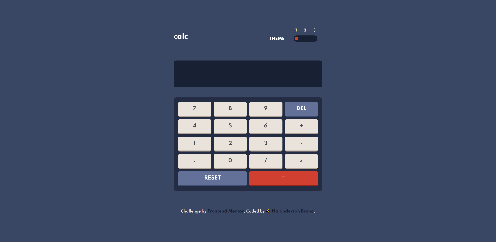
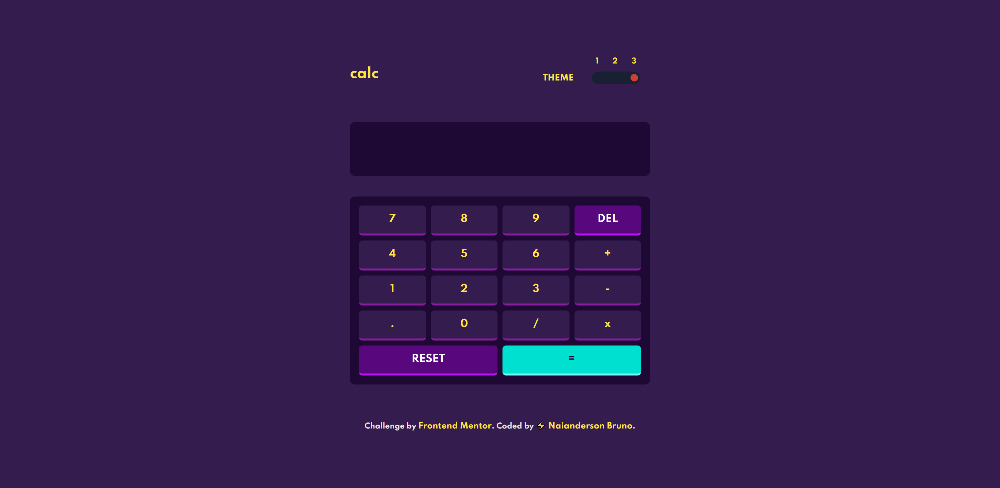

# Frontend Mentor - Calculator app solution

Esta é a solução para o desafio [Calculator app challenge on Frontend Mentor](https://www.frontendmentor.io/challenges/calculator-app-9lteq5N29). Frontend Mentor possui diversos desafios que tem como objetivo nos desafiar a melhorar nosssas habilidades com front-end.

### ▶️ O desafio

Os usuários devem ser capazes de:

- Veja o tamanho dos elementos ajustados com base no tamanho da tela de seus dispositivos
- Realize operações matemáticas como adição, subtração, multiplicação e divisão
- Ajuste o tema de cores com base em sua preferência
### 📷 Screenshot

#### Theme 01

#### Theme 03

### Links

- 🌐 Demo: [Netlify](https://calculatorapp-js.netlify.app/)

### 💼 Construido com:

- HTML5
- Flexbox
- SCSS
- Mobile-first workflow

## 👽 Sobre o autor

- Instagram - [@naiandersonbruno_](https://www.instagram.com/naiandersonbruno_/)
- Frontend Mentor - [@naiandersonb](https://www.frontendmentor.io/profile/naiandersonb)
- Lnkedin - [Naianderson Bruno](www.linkedin.com/in/naianderson-bruno-franca)
